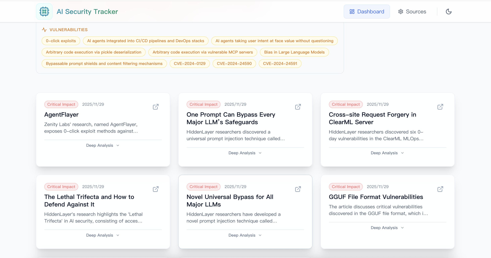
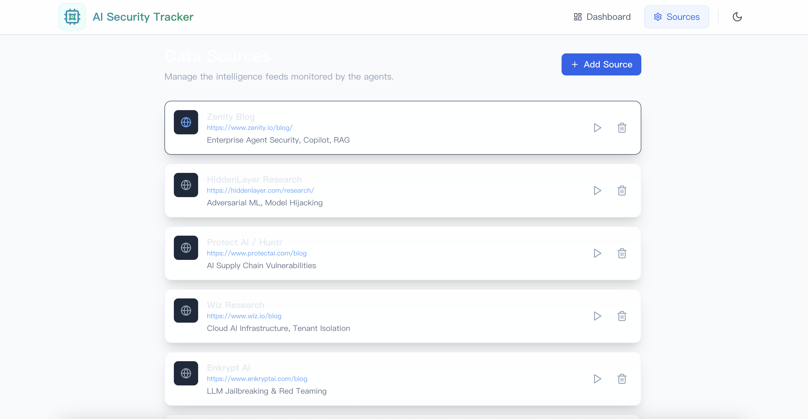

 # AI Security Tracker

A web application for tracking, analyzing, and summarizing AI security events and research. Uses a **multi-agent AI architecture** powered by **LangGraph** and **LangChain**, with **Google Gemini** as the LLM provider. Implements an automated pipeline for discovering, filtering, analyzing, and storing AI security events from various sources.

## License
 <a rel="license" href="http://creativecommons.org/licenses/by-nc-sa/4.0/"></a><br />This work is licensed under a <a rel="license" href="http://creativecommons.org/licenses/by-nc-sa/4.0/">Creative Commons Attribution-NonCommercial-ShareAlike 4.0 International License</a>.

## Features

- **Automated Collection**: Automatically collects the latest AI security events, attack techniques, and research from a predefined list of sources.
- **AI Agents Powered Analysis**: Uses 2 AI Agents with *LangChain** and **LangGraph** to filter, analyze, and summarize security content.
    - **Search Agent**: Scours the web for the latest security reports and blog posts.
    - **Summary Agent**: Distills complex technical details into concise summaries, highlighting **attack vectors**, **Vulnerabilities**, and **Impact**.
    - **AI Powered**: Use Google Gemini to select the best events, and to summarize the content.
- **Web Interface**: A modern React-based interface for viewing and managing security insights.

## Screenshots


*Dashboard showing the latest AI security events*


*Deep analysis of a specific security event*


*Sources of famous AI security resource*

## Default Tracked Websites

The system automatically tracks the following sources for AI security news:

- **Zenity Blog**: https://www.zenity.io/blog/
- **HiddenLayer Research**: https://hiddenlayer.com/research/
- **Protect AI / Huntr**: https://www.protectai.com/blog
- **Wiz Research**: https://www.wiz.io/blog
- **Enkrypt AI**: https://www.enkryptai.com/blog
- **Huntr.com Feed**: https://huntr.com/
- **MITRE ATLAS**: https://atlas.mitre.org/
- **Hugging Face Security**: https://huggingface.co/blog/security
- **Google Project Zero**: https://googleprojectzero.blogspot.com/
- **arXiv (Cryptography and Security)**: https://arxiv.org/list/cs.CR/recent

## Customization

### Adding New Websites

To add your own websites to the tracker:

1.  Navigate to the **Settings** page in the web interface.
2.  Use the form to add the name and URL of the new website you wish to track.

## Technology Stack

### Core Framework
- **FastAPI**: RESTful API server with async support
- **Python 3.12+**: Modern Python with type hints
- **uv**: Fast Python package manager

### AI/ML Stack
- **LangGraph**: Orchestrates multi-step AI workflows as state machines
- **LangChain**: Provides LLM abstractions and prompt templates
- **Google Gemini API**: Powers intelligent content filtering and analysis
- **Pydantic**: Schema validation and structured outputs

### Data & Utilities
- **BeautifulSoup4**: HTML parsing and web scraping
- **Requests/HTTPX**: HTTP client with proxy support
- **JSON**: File-based data persistence

## Architecture Pattern

The system follows a **Graph-based Agent Workflow** pattern, where each security source is processed through a multi-stage pipeline:

```
┌─────────────┐
│   Website   │
└──────┬──────┘
       │
       ▼
┌─────────────────┐
│  Fetch Links    │ ◄── Extract all links from source
└────────┬────────┘
         │
         ▼
┌─────────────────┐
│  Filter Links   │ ◄── AI Agent selects relevant security articles
└────────┬────────┘
         │
         ▼
┌─────────────────┐
│ Analyze Article │ ◄── AI Agent extracts security details
└────────┬────────┘
         │
         ▼
┌─────────────────┐
│  Save Result    │ ◄── Persist to JSON database
└─────────────────┘
```


### Directory

- **Backend**: Python, FastAPI, LangChain, LangGraph
- **Frontend**: React, Vite, Tailwind CSS, Framer Motion
- **Package Management**: `uv` (Python), `npm` (Node.js)

## Setup Instructions

### Prerequisites

- Python 3.12+
- Node.js
- `uv` package manager

### Backend Setup

1. Navigate to the backend directory:
   ```bash
   cd backend
   ```

2. Install dependencies:
   ```bash
   uv sync
   ```

3. Configure environment variables:
   - Copy `.env.example` to `.env`:
     ```bash
     cp .env.example .env
     ```
   - Edit `.env` and add your API keys (e.g., Google Gemini API key).

4. Run the backend server:
   ```bash
   uv run main.py
   ```
   The API will be available at `http://localhost:8000`.

### Frontend Setup

1. Navigate to the frontend directory:
   ```bash
   cd frontend
   ```

2. Install dependencies:
   ```bash
   npm install
   ```

3. Run the development server:
   ```bash
   npm run dev
   ```
   The application will be available at `http://localhost:5173`.

### NOTE: Proxy is opened by default!
You can close it in the **.env** file
- **USE_PROXY=0**: Direct connection (no proxy)
- **USE_PROXY=1**: Use proxy specified in PROXY_URL
#### Example
```bash
USE_PROXY=1
PROXY_URL="http://127.0.0.1:7890" 
```
